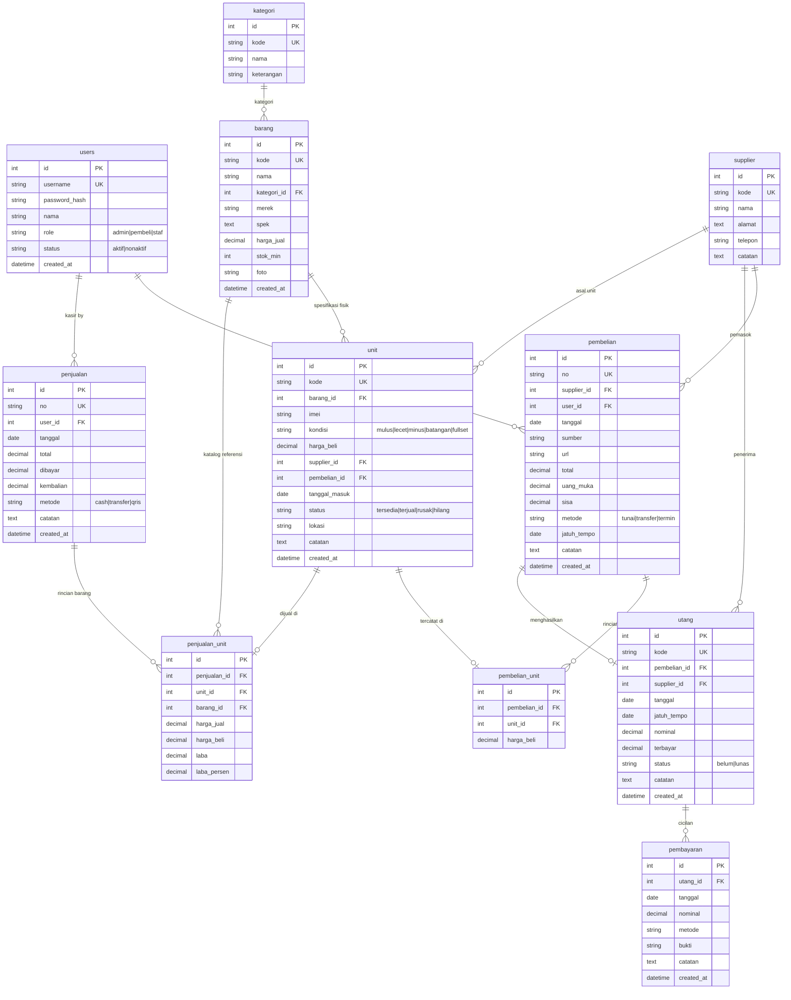

# Sistem Inventaris Barang & Tracking Unit (CodeIgniter 4)

Sistem informasi inventaris barang dagangan dengan penelusuran unit fisik individu (**IMEI/Serial Number & Kondisi**), pencatatan transaksi pembelian, kasir penjualan dengan **perhitungan laba kotor riil per unit**, serta manajemen utang usaha dan analisis *aging* (umur utang).

Dibangun menggunakan **PHP 8.3 / 8.5** dengan framework **CodeIgniter 4**, database **MariaDB/MySQL**, dan UI modern berbasis **Bootstrap 5 + Chart.js**.

---

## 🌟 Fitur Utama

### 1. Pelacakan Unit Fisik (Serial / IMEI Tracking)
- **Bukan sekadar counter stok**: Setiap unit handphone, laptop, atau gawai bekas dicatat sebagai entitas unik (`tabel unit`) yang memiliki nomor IMEI/SN, kondisi (`mulus`, `lecet`, `minus`, `batangan`, `fullset`), tanggal masuk, dan lokasi penyimpanan.
- **Harga modal spesifik**: Tiap unit mencatat harga beli aslinya sendiri saat dibeli, sehingga laba tidak terdistorsi fluktuasi harga kulak.
- **Siklus status unit**: `tersedia` ➔ `terjual` (otomatis lewat kasir), atau manual ke `rusak`/`hilang`.

### 2. Modul Kasir & Penjualan (Real Margin Calculation)
- **Pilih unit spesifik**: Kasir memilih device fisik yang ada di rak berdasarkan IMEI/kondisi.
- **Laba kotor riil**: Saat unit terjual, harga beli modal dikunci ke `penjualan_unit` bersama harga jual aktual. Laba riil dihitung:
  $$\text{Laba} = \text{Harga Jual Aktual} - \text{Harga Modal Beli Unit}$$
- **Dukungan pembatalan transaksi**: Jika transaksi dibatalkan, status unit otomatis kembali menjadi `tersedia` di stok.

### 3. Modul Pembelian & Supplier
- Pembelian mencatat supplier, sumber (Tokopedia, Shopee, Offline), dan rincian unit masuk secara dinamis.
- Mendukung metode pembayaran: **Tunai**, **Transfer**, dan **Termin (Utang)**.
- Transaksi termin otomatis membuat record utang baru beserta kalkulasi uang muka (DP) dan sisa kewajiban.

### 4. Manajemen Utang Usaha & Aging Analysis
- Monitoring jatuh tempo pembayaran ke supplier.
- **Aging buckets 4 level**:
  1. *Belum jatuh tempo* (≤ 0 hari)
  2. *1 - 30 hari*
  3. *31 - 60 hari*
  4. *> 60 hari* (Overdue / Menunggak)
- Pencatatan pembayaran cicilan bertahap dengan riwayat tanggal, nominal, metode, dan upload bukti transfer.

### 5. Dashboard Interaktif & Laporan Lengkap
- **Stat card**: Omzet bulan ini, Laba kotor bulan ini, Total unit tersedia, Total utang belum lunas.
- **Grafik tren 14 hari**: Perbandingan omzet harian vs laba bersih kotor (Chart.js).
- **Stok alert**: Notifikasi otomatis saat stok barang di bawah batas minimum (`stok_min`).
- **Laporan Laba/Rugi**: Filter rentang tanggal dengan kalkulasi margin keuntungan.
- **Laporan Posisi Stok**: Valuasi nilai modal aset stok dan estimasi potensi omzet.
- **Laporan Utang Usaha**: Rekap aging dan riwayat pembayaran.

### 6. Role-Based Access Control (RBAC)
- Tiga tingkatan peran pengguna:
  - `admin`: Akses penuh ke seluruh modul termasuk Manajemen Pengguna.
  - `pembeli`: Operator kasir (penjualan, stok, katalog).
  - `staf`: Operasional gudang (input pembelian, cek fisik unit, supplier).

---

## 🗄️ Entity Relationship Diagram (ERD)



---

## 🔑 Akun Demo Default

Data demo telah disiapkan dengan transaksi realistis, stok fisik bervariasi, dan utang dengan berbagai status aging:

| Username | Password | Role | Akses |
|---|---|---|---|
| `admin` | `admin123` | Administrator | Akses penuh seluruh sistem & manajemen user |
| `pembeli` | `pembeli123` | Kasir | Transaksi penjualan, cek stok, dan laporan |
| `staf` | `staf123` | Gudang | Input pembelian, manajemen unit stok & supplier |

---

## 🚀 Panduan Instalasi Lokal

### Kebutuhan Sistem
- PHP 8.2 atau lebih baru (ekstensi: `intl`, `mbstring`, `mysqli`, `pdo_mysql`)
- MariaDB 10.6+ atau MySQL 8.0+
- Composer 2.x

### Langkah-langkah
1. **Clone repository:**
   ```bash
   git clone https://github.com/sanhaji182/inventaris-ci4.git
   cd inventaris-ci4
   ```

2. **Install dependency:**
   ```bash
   composer install --no-dev
   ```

3. **Konfigurasi Environment:**
   Salin `.env.example` menjadi `.env` lalu sesuaikan kredensial database:
   ```ini
   CI_ENVIRONMENT = development

   app.baseURL = 'http://localhost:8080/'

   database.default.hostname = localhost
   database.default.database = inventaris_ci4
   database.default.username = inventaris
   database.default.password = your_password
   database.default.DBDriver = MySQLi
   database.default.port     = 3306
   ```

4. **Jalankan Migrasi & Seeder Demo:**
   ```bash
   php spark migrate --all
   php spark db:seed DemoSeeder
   ```

5. **Jalankan Local Server:**
   ```bash
   php spark serve --port 8080
   ```
   Buka browser di `http://localhost:8080/login`.

---

## 🔒 Keamanan (Security Hardening)
- Proteksi CSRF otomatis pada seluruh metode POST/PUT.
- Session cookie aman dengan regenerasi ID berkala saat login.
- Filter autentikasi terpusat pada seluruh rute aplikasi.
- Nginx configuration: blokir akses publik ke file internal (`.env`, `app/`, `writable/`, `.git`).
- Folder upload dibatasi dan nama file diacak menggunakan `getRandomName()`.

---

## 📄 Lisensi
MIT License. Dikembangkan untuk portofolio teknis dan implementasi inventaris gawai/elektronik.
