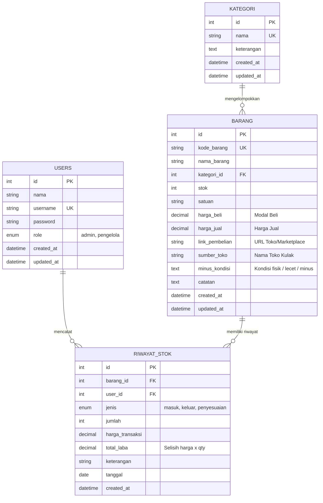

# Sistem Inventaris Barang Dagangan & Analisis Margin Laba-Rugi (Standar BNSP)

Aplikasi web inventaris barang dagangan berbasis **CodeIgniter 4 (MVC)**, dirancang ringkas, clean, modern, dan tepat sasaran untuk kebutuhan penilaian uji kompetensi **BNSP Skema Pemrogram Web (Junior Web Developer / Software Developer)**.

---

## 🎯 Fitur Inti (Fokus & Efisien)

1. **Master Katalog Barang Dagangan**:
   - Pencatatan stok fisik barang real-time (satuan Unit/Pcs/dll).
   - Pencatatan **Harga Beli (Modal Kulak)** & **Harga Jual**.
   - **Kalkulasi Margin Untung/Rugi Otomatis**: Menghitung selisih nominal (`Harga Jual - Harga Beli`) dan persentase profit terhadap modal secara real-time.
   - **Sumber & Link Pembelian**: Mencatat nama toko kulak dan link URL marketplace (Tokopedia, Shopee, dll).
   - **Minus / Kondisi Fisik**: Kolom khusus mencatat minus barang (misal bekas, lecet pemakaian, battery health, batangan, dsb).
   - **Catatan Tambahan**: Garansi toko, posisi rak etalase, info garansi resmi.

2. **Pencatatan Keluar / Masuk Stok**:
   - Mencatat barang masuk (tambah kulakan).
   - Mencatat barang keluar (terjual ke pembeli / afkir) dengan kalkulasi akumulasi laba bersih yang terealisasi secara instan.
   - Penyesuaian fisik (stock opname).

3. **Hak Akses Pengguna (Role-Based Access Control / RBAC)**:
   - **Admin**: Akses penuh seluruh sistem (kelola user, tambah/edit/hapus barang, kelola kategori, dan rekap profit).
   - **Pengelola**: Akses operasional harian (input data barang, update stok keluar/masuk, pantau harga beli & margin jual), terproteksi dari menu manajemen user.

4. **Dashboard Eksekutif Ringkas (Modern Light Mode)**:
   - Total varian barang & total unit fisik.
   - Total modal inventaris (nilai aset modal harga beli).
   - Potensi keuntungan jika seluruh stok terjual.
   - Realisasi laba bersih terkumpul dari barang keluar.
   - Alert peringatan stok menipis (sisa $\le 2$ unit) lengkap dengan tombol cepat **"Beli Lagi"** menuju link pembelian.

---

## 🔐 Akun Akses Demo (Sesuai Hak Akses BNSP)

| Role | Username | Password | Deskripsi Wewenang |
|---|---|---|---|
| **Admin** | `admin` | `admin123` | Akses penuh seluruh menu + Kelola Hak Akses Pengguna |
| **Pengelola** | `pengelola` | `pengelola123` | Kelola katalog barang, kategori & keluar/masuk stok |

---

## 🗄️ Struktur Database (ERD)



---

## 🚀 Panduan Instalasi Lokal

### 1. Kebutuhan Sistem
- PHP >= 8.1 (dengan ekstensi `intl`, `mbstring`, `mysqli`)
- MariaDB / MySQL >= 10.4
- Composer

### 2. Langkah Setup
```bash
# Clone repository
git clone https://github.com/sanhaji182/inventaris-ci4.git
cd inventaris-ci4

# Install dependency
composer install

# Salin konfigurasi environment
cp env .env
```

Sesuaikan `.env`:
```ini
CI_ENVIRONMENT = development
app.baseURL = 'http://localhost:8080/'

database.default.hostname = localhost
database.default.database = inventaris_ci4
database.default.username = root
database.default.password = 
database.default.DBDriver = MySQLi
```

Jalankan migrasi tabel dan data awal demo:
```bash
php spark migrate
php spark db:seed DemoSeeder
php spark serve
```
Akses di browser: `http://localhost:8080`
